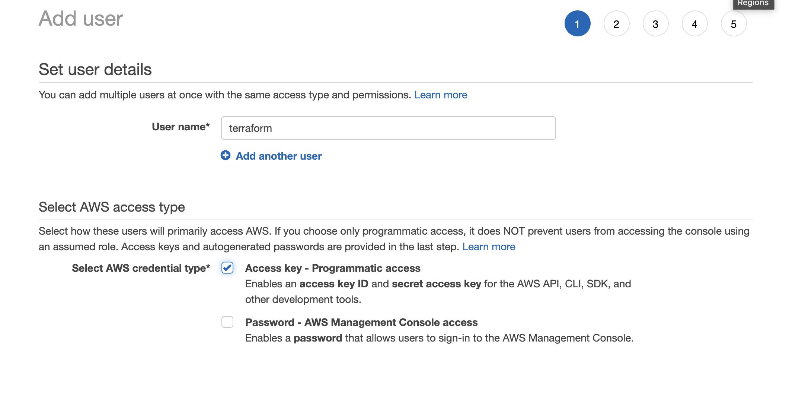
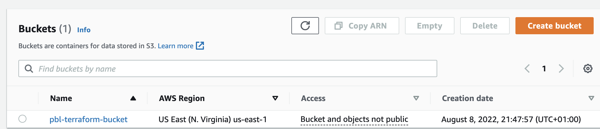

# Automate Infrastructure With IAC Using Terraform - Part 1

This project demonstrates how the AWS infrastructure for 2 websites that was built manually in [project 15](https://github.com/enyioman/project15) is automated with the use of Terraform.

The architecture remains the AWS end-to-end solution for a 3-tier application.

## STEP 1: Setting Up AWS CLI And S3 Bucket

- Create an IAM user, name it `terraform` (ensure that the user has only programmatic access to your AWS account) and grant this user `AdministratorAccess` permissions.

- Copy/save the secret access key and access key ID. 

- Configure programmatic access from your workstation to connect to AWS using the access keys copied above and a Python SDK (boto3). You must have Python 3.6 or higher on your workstation. I used `awscli` for the above step, by using `aws configure`.

- Create an S3 bucket to store Terraform state file. We will use this bucket from Project-17 onwards.

